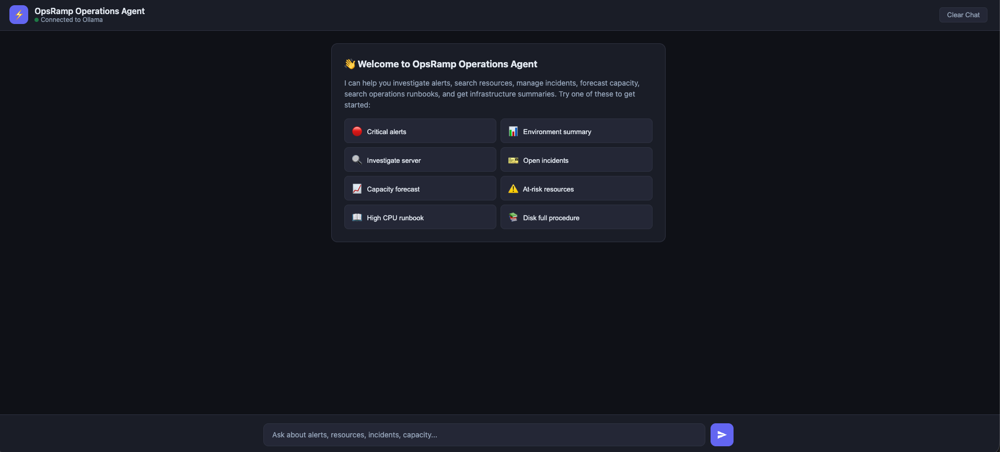
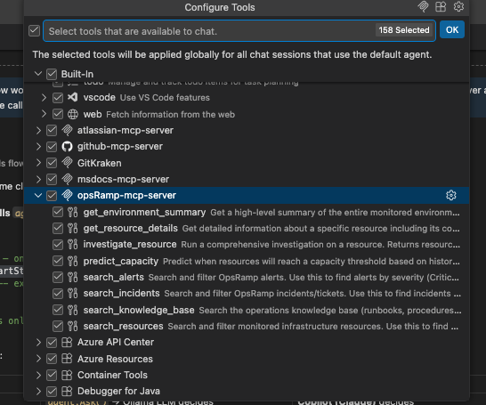

# OpsRamp ChatBot

An AI-powered OpsRamp operations assistant that lets you query your infrastructure using natural language. Ask about alerts, resources, incidents, capacity forecasts, and operations runbooks — the agent figures out what to look up and responds with clear, actionable answers.

## Web UI



## MCP Server



## What You Can Ask

- **Alerts** — "Show me all critical alerts" · "Any P0 alerts?"
- **Resources** — "List all AWS resources" · "Show servers in GCP"
- **Incidents** — "Show open incidents" · "Any urgent tickets?"
- **Investigation** — "Investigate web-server-prod-01" · "Why is the DB slow?"
- **Environment** — "Give me an environment summary"
- **Capacity Forecast** — "Predict capacity for db-primary-01" · "Which resources are at risk?"
- **Knowledge Base** — "What is the runbook for high CPU?" · "How to fix disk full?" · "Escalation contacts?"

## Capabilities
- **Search Alerts** - filter by state (Critical/Warning), priority, resource
- **Search Resources** - find servers across AWS, Azure, GCP, on-prem
- **Resource Details** — deep-dive into configuration, metrics, tags
- **Search Incidents** - filter tickets by status, priority, SLA
- **Investigate Resource** -correlated view of alerts + incidents + metrics for a resource
- **Environment Summary** -high-level infrastructure health dashboard
- **Capacity Forecasting** -linear regression on 30-day metric history to predict CPU/memory/disk exhaustion
- **Knowledge Base (RAG)** - retrieval-augmented generation over operations runbooks (PDF), using vector embeddings and cosine similarity search
- **MCP Server Mode** - exposes all 8 tools as a Model Context Protocol server (stdio + HTTP transport) for Claude Desktop, VS Code Copilot, and other MCP-compatible clients

## How MCP Mode Works

In MCP mode, **Copilot (or Claude) is the LLM** — not Ollama. The agent acts as a tool server only.

```
You (in VS Code / Claude Desktop)
 │
 ▼
Copilot / Claude  ← decides which tools to call
 │
 │  MCP protocol (stdio or HTTP)
 ▼
opsramp-agent --mcp  ← executes tools, returns JSON
 │
 ├─ search_alerts, search_resources, etc. → mock OpsRamp data
 └─ search_knowledge_base → Ollama embeddings (only Ollama use in MCP mode)
 │
 ▼
Copilot / Claude  ← summarizes results back to you
```

- **Ollama LLM is NOT used** — Copilot's own model handles reasoning and tool selection
- **Ollama is only needed** for the embedding model (`nomic-embed-text`) that powers runbook search
- The 8 tools + their descriptions are advertised via MCP's `initialize` handshake, so the client LLM knows what's available
